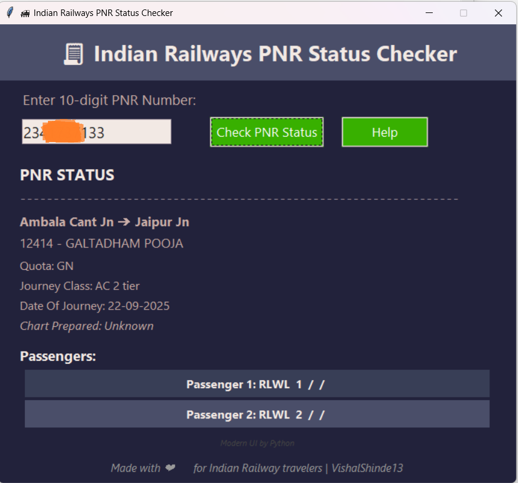

# Indian Railways PNR Status Checker

A modern Python GUI app to check Indian Railways PNR status, with encryption and a visually appealing interface.

## Features

- Enter a 10-digit PNR, view real-time status.
- Modern Tkinter-based UI.
- Uses cryptography for secure API calls.

## Requirements

- Python 3.x
- `cryptography`, `requests`, `tkinter`

## Usage

```bash
python pnr_status.py
```

## Author

[VishalShinde13](https://github.com/VishalShinde13)


